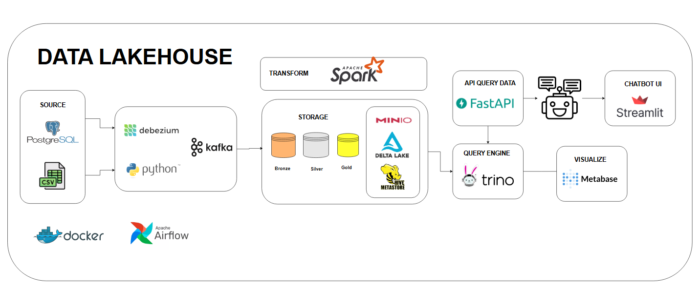

# Lakehouse ChatBot

A modern data lakehouse platform with conversational AI interface for querying data using natural language.

## Technologies and Architecture

### **Backend & APIs**
| Technology | Version | Purpose | Description |
|------------|---------|---------|-------------|
| **Python** | 3.11 | Core Language | Main programming language for all services |
| **FastAPI** | Latest | REST API | High-performance API gateway for Trino queries |
| **Streamlit** | Latest | Web UI | Interactive natural language query interface |
| **Apache Airflow** | 3.1.0 | Workflow Orchestration | DAG scheduling and pipeline management |

### **Data Processing & Lakehouse**
| Technology | Version | Purpose | Description |
|------------|---------|---------|-------------|
| **Apache Spark** | 4.0.0 | Distributed Processing | Data transformation and processing engine |
| **Delta Lake** | 3.2.0 | ACID Transactions | Reliable data lake storage with ACID properties |
| **Apache Kafka** | 4.1.0 | Event Streaming | Real-time data ingestion and streaming |
| **Trino** | 475 | SQL Query Engine | Distributed SQL engine for querying data lake |
| **Hive Metastore** | 4.0.0 | Metadata Catalog | Centralized metadata management for data lake |

### **Storage & Databases**
| Technology | Version | Purpose | Description |
|------------|---------|---------|-------------|
| **PostgreSQL** | 16 | OLTP Database | Primary transactional database for e-commerce data |
| **MinIO** | Latest | Object Storage | S3-compatible object storage for data lake |

### **Business Intelligence & Visualization**
| Technology | Version | Purpose | Description |
|------------|---------|---------|-------------|
| **Metabase** | 0.56.10 | BI Dashboards | Business intelligence and dashboard creation |

### **AI & Natural Language Processing**
| Technology | Purpose | Description |
|------------|---------|-------------|
| **LangChain** | LLM Framework | Framework for developing LLM applications |
| **Streamlit Chat** | Chat Interface | Enhanced chat components for Streamlit |
